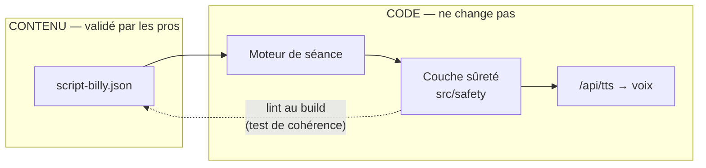
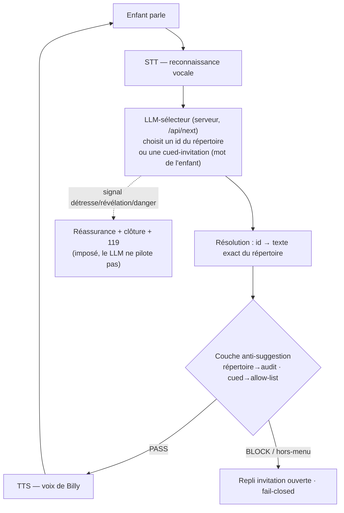
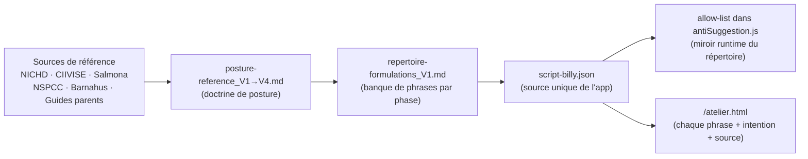
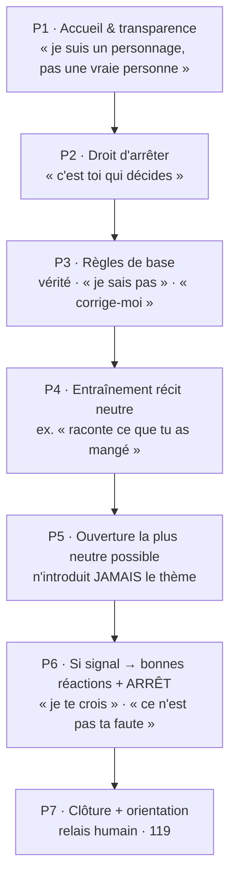
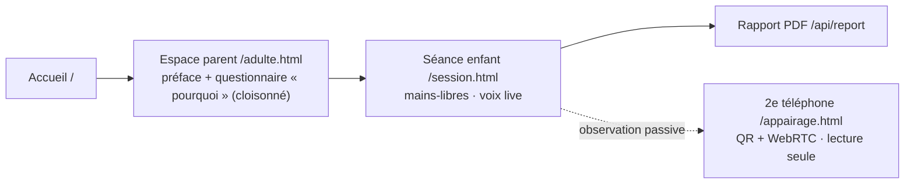
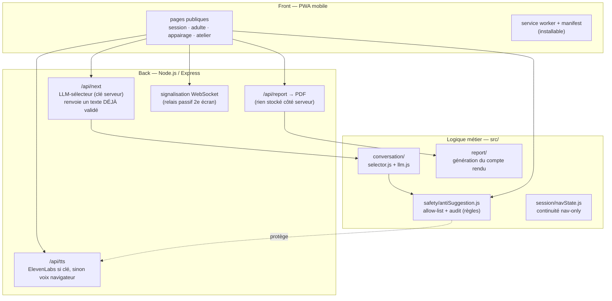

# Billy — Présentation fonctionnelle & technique (page wiki)

> Page de présentation destinée à l'espace wiki Billy. Diagrammes en **Mermaid** (rendu
> natif sur la plupart des wikis ; sinon coller le code dans https://mermaid.live).
> Source de vérité du contenu : `public/content/script-billy.json` (statut : **brouillon, non validé**).

---

## 1. Billy en une phrase

Billy est une **PWA mobile** à IA vocale, incarnée par un écureuil bienveillant, qui aide à
**repérer** si un jeune enfant (cible **2-5 ans**) a pu subir une violence — **sans jamais
l'interroger** — puis **oriente vers les professionnels**.

Posture = **Option A** : *mise en confiance → ouverture neutre → repérage de signaux →
orientation*. Billy **n'investigue pas, ne qualifie pas, ne conclut pas, ne nomme aucun auteur**.
Le recueil du récit sensible reste 100 % au professionnel humain.

---

## 2. Le principe central : contenu ↔ code séparés

Tout ce que Billy dit provient d'**un seul fichier de contenu** : `public/content/script-billy.json`.
Le code ne *génère* jamais une phrase — il *sélectionne* une formulation pré-validée. C'est ce qui
rend le système **sûr, auditable et corrigeable sans toucher au code**.

> **Choisir ≠ inventer.** Depuis la V1-démo, la sélection est assistée par un **LLM-sélecteur** :
> le modèle **choisit** la meilleure réplique dans le répertoire (ou une *cued-invitation* reprenant
> un mot de l'enfant), il ne **rédige jamais** le texte prononcé. Son espace de sortie est clos et
> entièrement repassé par la couche sûreté avant la voix. Détails : `docs/V2-llm-selecteur.md`.



> Quand les professionnels valident, on **remplace `script-billy.json`** — **aucune ligne de
> code** à modifier.

---

## 3. La boucle vocale temps réel (cœur fonctionnel)



- **Choisir ≠ inventer** : le LLM ne peut désigner qu'une réplique du répertoire de la phase
  courante, ou une *cued-invitation* reprenant un mot **réellement dit** par l'enfant. Aucune
  génération de texte libre. Sans clé LLM → **repli déterministe** (la démo marche hors-ligne).
- **Double rempart** : le serveur ne renvoie qu'un texte déjà validé, et le front le repasse une
  2ᵉ fois par `audit()` (défense en profondeur).
- **Fail-closed** : tout `id` halluciné / hors-phase, mot hors-lexique ou tabou, réponse malformée
  → **repli sur invitation ouverte**. Jamais de risque de question suggestive.
- **Clé jamais exposée** : l'appel LLM est **serveur** (`ANTHROPIC_API_KEY`), jamais dans le navigateur.

---

## 4. Comment le **fichier d'interrogation de Billy** a été alimenté

C'est le point clé. `script-billy.json` n'a **pas** été écrit à l'inspiration : il est le produit
d'une **chaîne de distillation** depuis des sources reconnues jusqu'au fichier machine.



### Les 5 étapes, concrètement

1. **Sources** → on extrait des **principes de posture** (questions ouvertes uniquement ; ne
   jamais nommer un acte/une partie du corps/un lieu/un auteur ; pas de pression ; entretien
   unique ; ne pas promettre le secret ; orienter vers le 119).
2. **`posture-reference_V1..V4.md`** → ces principes deviennent une **doctrine versionnée**
   (chaque version affine, on n'écrase jamais une version précédente).
3. **`repertoire-formulations_V1.md`** → on rédige une **banque fermée de phrases**, classées par
   **phase NICHD**, avec les **contre-exemples interdits**.
4. **`script-billy.json`** → la banque devient le **fichier machine** que l'app lit. Chaque phrase
   est un objet **traçable** (voir 4.1).
5. **Garde-fous de cohérence** :
   - un **test** (`src/safety/script-coherence.test.js`) vérifie que **chaque phrase du JSON passe
     la couche anti-suggestion** ;
   - la page **`/atelier.html`** (« Cahier de la posture ») affiche chaque phrase avec son
     **intention, sa justification et sa source** — c'est le support de **revue par les pros**.

### 4.1 Anatomie d'une phrase dans `script-billy.json`

Chaque énoncé est traçable champ par champ :

```json
{
  "id": "P4-1",
  "type": "billy_demande",
  "statut": "à revoir",
  "intent": "Invitation neutre : raconter le repas du matin (concret)",
  "formulation": "Raconte-moi ce que tu as mangé ce matin.",
  "justification": "Récit épisodique NICHD, concret 2-5.",
  "source": "NICHD 2021 / techniques-interview-2-5"
}
```

| Champ | Rôle |
|---|---|
| `id` | identifiant stable (`P4-1` = phase 4, item 1) — **c'est ce que le LLM-sélecteur renvoie** |
| `type` | nature de l'énoncé : `billy_dit`, `billy_demande`, `relance_ouverte`, `reaction` |
| `statut` | cycle de validation : `brouillon` → `proposé` → **`validé`** → `à revoir` |
| `intent` | libellé court : **le seul texte que voit le LLM** pour choisir (il ne voit pas, ne copie pas la formulation à l'aveugle) |
| `formulation` | **le texte exact** que Billy peut dire |
| `justification` | le principe de posture qui la fonde |
| `source` | la référence d'où elle vient (traçabilité) |

> Le fichier porte aussi un bloc **`selecteur`** (phases jouées en démo neutre, invitations de repli,
> réassurance imposée sur signal, plafond de tours par phase) qui paramètre le LLM-sélecteur.

Le fichier contient aussi 3 sections transverses : **`interdits`** (ce que Billy ne dit JAMAIS),
**`orientation`** (les numéros par niveau d'urgence), **`rapport`** (ce que contient le compte rendu).

> ⚠️ **Statut global du fichier = `brouillon`.** Aucune phrase n'est dite à un enfant tant que les
> professionnels ne l'ont pas signée. Voir `docs/00-POUR-VALIDATION-PRO.md`.

---

## 5. Les 7 phases NICHD (déroulé d'une séance)

Telles que définies dans `script-billy.json` :



**Règle d'or (Option A)** : dès qu'un **signal sérieux** apparaît en P6, Billy **n'approfondit
pas** — il rassure sans qualifier et passe le relais. Le récit sensible est recueilli par l'humain.

### Séance de retour (V2 — multi-séances)
Accueil bref → P3 abrégé → P4 sur un **sujet neutre différent** → P5 identique, **sans jamais
référencer la séance précédente**. La continuité est **« silencieuse »** : on ne mémorise que la
*navigation* (où on en était), **jamais le contenu** (cf. `docs/V2-multi-seances_PO.md`).

---

## 6. Parcours utilisateur



- **Questionnaire « pourquoi » cloisonné** : le motif du parent sert au suivi/rapport, **jamais
  transmis à Billy** ni à ses questions à l'enfant (pare-feu anti-contamination).
- **2ᵉ téléphone** : observateurs **strictement passifs** — ils voient/entendent mais **ne peuvent
  rien changer** au déroulé (esprit Barnahus).

---

## 7. Architecture technique (V1)



- **Front** : PWA mobile-first (manifest + service worker, installable, pas de store natif en V1).
- **Back** : Node.js / Express ; `/api/next` (LLM-sélecteur), `/api/tts` (voix), `/api/report`
  (PDF local). Aucune donnée enfant persistée côté serveur.
- **Conversation** : `src/conversation/selector.js` (choix + validation fail-closed) et `llm.js`
  (appel Anthropic, tool_use forcé, clé serveur ; sans clé → repli déterministe).
- **Sûreté** : `src/safety/antiSuggestion.js` (allow-list + audit), `src/session/navState.js`
  (continuité limitée à la navigation, jamais de contenu).
- **Temps réel 2ᵉ écran** : WebRTC + signalisation WebSocket, observateurs passifs.
- **Sécurité** : pas de clé en dur (`.env`), HTTP + HTTPS auto-signé en dev.
- **Tests** : suite Node (`npm test`).

---

## 8. Glossaire des acronymes

### Protocole & posture
| Acronyme / terme | Signification |
|---|---|
| **NICHD** | *National Institute of Child Health and Human Development* — protocole d'audition non-suggestive de l'enfant (socle de Billy) |
| **Option A** | Cadrage retenu : Billy = support & orientation (pas de recueil du récit sensible) |
| **Modèle A** | Règle interne : Billy ne dit que des phrases validées et ne reprend que les mots de l'enfant (le LLM-sélecteur respecte cette règle : il choisit, il n'invente pas) |
| **Barnahus** | « maison des enfants » (islandais) — modèle : un intervenant + observateurs passifs |
| **PROMISE** | Projet européen de standards Barnahus |
| **Cued invitation** | Relance ouverte construite **uniquement** sur un mot déjà dit par l'enfant |

### Technique
| Acronyme | Signification |
|---|---|
| **PWA** | *Progressive Web App* — site web installable comme une appli |
| **STT** | *Speech-To-Text* — reconnaissance vocale (enfant → texte) |
| **TTS** | *Text-To-Speech* — synthèse vocale (texte → voix de Billy) |
| **LLM** | *Large Language Model* — grand modèle de langage. Utilisé **uniquement comme sélecteur contraint** (choisit une réplique du répertoire), **jamais comme générateur** de texte face à l'enfant. Le VETO « LLM libre face à l'enfant » reste en vigueur |
| **LLM-sélecteur** | Le LLM aiguilleur : reçoit un menu d'`id` + `intent`, renvoie un choix structuré ; tout repasse par la couche sûreté. Voir `docs/V2-llm-selecteur.md` |
| **VAD** | *Voice Activity Detection* — détection automatique de fin de parole (V2) |
| **WebRTC** | *Web Real-Time Communication* — flux audio/vidéo direct entre appareils |
| **TURN** | *Traversal Using Relays around NAT* — serveur relais pour WebRTC hors réseau local |
| **QR** | *Quick Response* (code) — appairage du 2ᵉ téléphone en un scan |
| **AES-256** | standard de chiffrement des données **au repos** |
| **TLS** | *Transport Layer Security* — chiffrement des données **en transit** |
| **POC** | *Proof Of Concept* — prototype de démonstration |
| **UX / UI** | *User Experience / User Interface* |
| **PO / QA** | *Product Owner / Quality Assurance* |
| **CI/CD** | intégration / déploiement continus |

### Conformité & données
| Acronyme | Signification |
|---|---|
| **RGPD** | Règlement Général sur la Protection des Données |
| **DPIA / AIPD** | *Data Protection Impact Assessment* / Analyse d'Impact relative à la Protection des Données (obligatoire ici) |
| **DPA** | *Data Processing Agreement* — contrat de sous-traitance des données (à signer avec STT/TTS) |
| **DPO** | *Data Protection Officer* — délégué à la protection des données |

### Protection de l'enfance — orientation
| Numéro / sigle | Signification |
|---|---|
| **119** | Allô Enfance en Danger — national, gratuit, 24/7 (réflexe principal) |
| **17 / 112** | police / urgence européenne (danger immédiat) |
| **15** | SAMU (urgence vitale / médicale) · **18** pompiers |
| **3018** | violences numériques |
| **UAPED** | Unité d'Accueil Pédiatrique Enfance en Danger |
| **CRIP** | Cellule de Recueil des Informations Préoccupantes |
| **IP** | Information Préoccupante |

### Sources citées dans la posture
| Sigle | Signification |
|---|---|
| **CIIVISE** | Commission Indépendante sur l'Inceste et les Violences Sexuelles faites aux Enfants |
| **MIPROF** | Mission Interministérielle pour la Protection des femmes contre les violences |
| **CRIAVS** | Centre Ressource pour les Intervenants Auprès des auteurs de Violences Sexuelles (repères de développement par âge) |
| **NSPCC** | *National Society for the Prevention of Cruelty to Children* (UK) |
| **RAINN** | *Rape, Abuse & Incest National Network* (US) |
| **VSM** | Violences Sexuelles sur Mineurs (Guide parents, Ville de Paris) |

---

## 9. Pour aller plus loin (documents liés)
- **Cadrage** : `docs/00-CADRAGE.md` · **Cible** : `docs/cible-2-5-ans.md`
- **Posture** : `docs/posture-reference_V1.md` → `V4.md` · `docs/techniques-interview-2-5.md`
- **Sécurité** : `docs/spec-safety-layer.md` · `docs/redteam-rapport-V1.md` · `src/safety/`
- **LLM-sélecteur** : `docs/V2-llm-selecteur.md` · `src/conversation/`
- **Validation pro** : `docs/00-POUR-VALIDATION-PRO.md`
- **V2** : `docs/roadmap-V2.md` · `docs/V2-multi-seances_PO.md`
- **Outil vivant** : page **`/atelier.html`** (chaque phrase + intention + justification + source)
