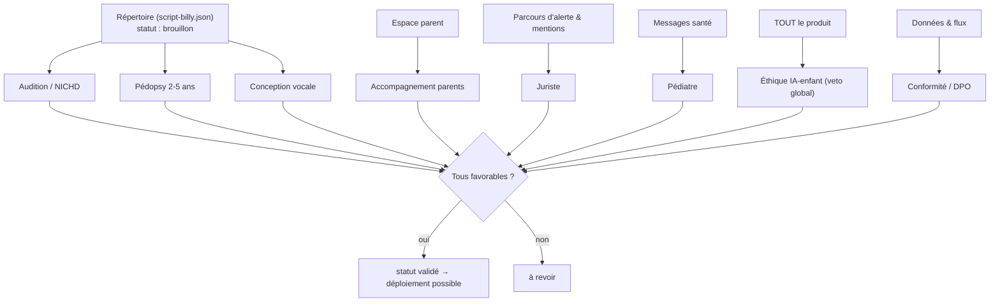

# Le projet Billy — attentes de chaque professionnel

> Page wiki « projet ». Billy touche à un domaine à très haut risque (mineur, santé, pénal).
> Il ne peut pas être validé par une seule personne : **chaque professionnel valide son
> périmètre et dispose d'un droit de regard (voire de veto) sur ce qui le concerne.**
> Page compagne : « Comment est construit le répertoire de dialogue de Billy »
> (`docs/wiki-repertoire-dialogue.md`). Dossier d'entrée pro : `docs/00-POUR-VALIDATION-PRO.md`.

---

## 1. Pourquoi plusieurs professionnels

Une seule expertise ne suffit pas : une phrase peut être **juridiquement** prudente mais
**développementalement** inadaptée, ou **cliniquement** douce mais **suggestive**. Billy n'est
sûr que si **chaque dimension** est tenue par le bon spécialiste. La règle du projet :

> **On ne code pas (ni ne déploie) avant cadrage validé.** Aucune phrase ne passe au statut
> `validé` sans l'aval écrit du professionnel compétent. (cf. `CLAUDE.md`, `docs/00-CADRAGE.md`)

Ces rôles existent déjà comme **sous-agents** dans `.claude/agents/` (préfixe `billy-*`) : ils
portent la doctrine au quotidien et préparent ce que les **vrais professionnels externes**
devront ensuite signer.

---

## 2. Attentes par professionnel

### 🧩 Expert audition / forensique — *non-suggestibilité* (`billy-expert-audition`)
**Mission.** Garantir qu'aucune formulation ne contamine la parole de l'enfant (socle NICHD
révisé, Barnahus / PROMISE, white paper EAPL).
**Ce qu'il valide.**
- La **hiérarchie des questions** : invitations > cued invitations (mot de l'enfant) > Wh-
  ouvertes ; **fermées / orientées / à choix forcé = interdites par construction**.
- Le **découpage en 7 phases** et la « transition la plus ouverte possible » (jamais introduire
  le thème de l'abus).
- L'**audit phrase par phase** du répertoire et les **règles testables** de `src/safety/`.
**Veto.** Rejette toute phrase qui nomme un acte/auteur/lieu non dit, suggère, présuppose,
met la pression ou répète une fermée. Marque les points exigeant un auditeur formé réel.

### 🧠 Pédopsychologue / pédopsychiatre petite enfance — *adaptation & sécurité émotionnelle* (`billy-pedopsychologue`)
**Mission.** Garantir que tout est **développementalement juste, sécurisant, non-traumatisant**.
**Ce qu'il valide.**
- L'**adaptation à l'âge 2-5 ans** (vocabulaire, un concept par phrase, rythme, silences,
  longueur) — **point le plus sensible du projet**.
- La **sécurité émotionnelle** : réassurance **sans valider le contenu**, droit de s'arrêter,
  zéro pression, zéro récompense.
- Les **signaux de détresse/trauma** qui déclenchent l'arrêt + escalade.
**Veto.** Signale tout ce qui pourrait culpabiliser, effrayer ou suggérer. Rappelle que
l'absence de récit n'est pas une preuve d'absence de faits. **Revalidation petite enfance
impérative** avant tout usage réel.

### ⚖️ Juriste / protection de l'enfance — *cadre légal & recevabilité* (`billy-juriste-protection-enfance`)
**Mission.** Sécuriser juridiquement le parcours et protéger la **recevabilité** de la parole.
**Ce qu'il valide.**
- Le **parcours d'alerte** : **119** réflexe par défaut ; **IP → CRIP** ; **signalement →
  procureur** si danger grave/imminent ; 17/112 immédiat ; 15 vital.
- L'**accès aux numéros d'aide sans authentification ni consentement** (conflit d'intérêts :
  le parent peut être l'auteur).
- Les **mentions légales**, l'information des titulaires de l'autorité parentale, les clauses
  « Billy n'est ni un service d'urgence, ni un avis juridique/médical, ni une preuve ».
**Veto.** Bloque tant que les conditions légales ne sont pas levées. *Produit un cadre interne,
à faire confirmer par un avocat spécialisé + un magistrat avant production.*

### 🩺 Pédiatre / référent santé — *ligne médicale* (`billy-pediatre`)
**Mission.** Apporter le regard médical prudent sans jamais que Billy diagnostique ou examine.
**Ce qu'il valide.**
- Les **indicateurs non spécifiques** (régressions, sommeil/alimentation, hypervigilance,
  propos/jeux sexualisés inadaptés ; douleurs/lésions **rapportées**, jamais recherchées).
- Le **message d'orientation** médical : clair, **non-anxiogène, non-diagnostique** (médecin
  traitant, urgences pédiatriques, **UAPED**, 15 si vital).
**Veto.** Garantit que Billy **ne pose aucune question sur le corps** et n'interprète aucun
symptôme. *À faire valider par un médecin réel (pédiatrie / médecine légale).*

### 🛡️ Éthique & sûreté IA-enfant — *garde-fous & red-team* (`billy-ethique-ia-enfant`)
**Mission.** Défendre l'enfant **contre les risques propres à l'IA** ; mandat d'**adversaire**.
**Ce qu'il valide.**
- **Transparence** (Billy est un programme), **zéro dark pattern** (pas d'engagement, de
  récompense, de rétention), **pas de dépendance affective**, **humain dans la boucle**.
- La **robustesse au détournement** : red-team du script et du sélecteur (faire suggérer,
  mentir, presser, retenir, conclure) → un garde-fou testable par dérive trouvée.
- En particulier : que le **sélecteur LLM choisit sans jamais générer** (cf. page répertoire §7).
**Veto.** **Veto global** opposable avant chaque release : si une fonctionnalité peut nuire,
elle ne sort pas.

### 🎙️ Conception vocale / conversation enfant — *incarnation* (`billy-conception-vocale-enfant`)
**Mission.** Donner à Billy une présence douce et crédible **sans jamais** assouplir les règles
de non-suggestion (forme et fond indissociables).
**Ce qu'il valide.**
- La **persona** : bienveillante, calme, honnête sur sa nature, **pas une « meilleure amie »**.
- L'**expérience vocale** : latence faible, **barge-in** (l'enfant coupe Billy ; Billy ne coupe
  jamais l'enfant), **silences respectés**, voix douce/débit lent, droit d'arrêt toujours dicible.
- L'**avatar / UI** sobres (pas de gamification), accessibilité (sous-titres, contraste).
**Veto.** Refuse tout ton qui dramatise/banalise ; **chaque réplique passe le filtre
`src/safety/` avant la voix**, accueil et transitions compris.

### 👪 Accompagnement des parents — *l'espace parent* (`billy-accompagnement-parents`)
**Mission.** Dé-escalader le parent (souvent en état de choc) pour qu'il **ne mène pas
d'interrogatoire** et réagisse de façon soutenante.
**Ce qu'il valide.**
- Les **3 blocs ordonnés** : dé-escalade émotionnelle → psychoéducation (pourquoi ne pas
  questionner soi-même) → marche à suivre (119 en tête).
- Les **phrases-modèles soutenantes** (« je te crois », « tu as bien fait », « ce n'est pas ta
  faute ») et la **friction anti-interrogatoire** (aucun outil de questionnement côté parent).
**Veto.** L'espace parent **n'invite jamais** le parent à extraire des détails ; pas de conseil
thérapeutique/juridique personnalisé → orientation vers les pros et ressources.

### 🔐 Conformité / DPO (RGPD) — *données ultra-sensibles* (`factory-expert-conformite`)
**Mission.** Encadrer des données de **mineur + santé + éventuelle infraction** = catégories les
plus sensibles.
**Ce qu'il valide.**
- **DPIA/AIPD obligatoire**, base légale, **minimisation extrême**, **pas d'enregistrement par
  défaut**, conservation limitée, chiffrement transit + repos, **hébergement UE**.
- **DPA signés** avec chaque fournisseur STT/TTS/LLM ; **pas de données enfant dans
  logs/analytics/tiers** ; pas de transfert hors UE non encadré.
**Veto.** **L'enregistrement réel des séances reste désactivé tant que la DPIA n'est pas
finalisée.** (cf. `docs/rgpd-donnees-sensibles.md`)

---

## 3. Vue d'ensemble

| Professionnel | Garde le… | Valide surtout | Point bloquant typique |
|---|---|---|---|
| Expert audition (NICHD) | non-suggestibilité | hiérarchie des questions, 7 phases, audit du répertoire | une phrase suggestive/présupposée |
| Pédopsy petite enfance | sécurité émotionnelle | adaptation 2-5 ans, réassurance, signaux | inadaptation à l'âge |
| Juriste / protection | recevabilité & alerte | parcours 119/CRIP/procureur, accès sans auth | mentions & conflit d'intérêts |
| Pédiatre / santé | ligne médicale | indicateurs, message non-anxiogène | question sur le corps |
| Éthique IA-enfant | garde-fous IA | transparence, anti-dark-pattern, red-team | dérive du sélecteur / persona |
| Conception vocale | incarnation | persona non-amie, UX vocale, sobriété | ton manipulateur |
| Accompagnement parents | espace parent | 3 blocs, friction anti-interrogatoire | outil de questionnement parent |
| Conformité / DPO | données | DPIA, DPA, minimisation, UE | DPIA non finalisée |

---

## 4. Conditions bloquantes encore ouvertes (rappel)

Ce sont des **gates** (décisions/validations), pas du code :
- **DPIA/AIPD** mise à jour + avis DPO ; **DPA** fournisseurs UE.
- **Validation pro NICHD** du répertoire et du **modèle de reprise/sélection**.
- **Scripts de consentement** parental + parcours d'accès aux numéros d'aide sans
  authentification.
- **Revalidation pédopsychiatrie petite enfance** de la cible 2-5 ans.
- **Levée du veto éthique** (anti-suggestion prouvée, fail-closed, robustesse jailbreak,
  escalade ~100 %).

> Tant que ces gates ne sont pas levées, le contenu reste **brouillon** et l'enregistrement
> réel des séances reste **désactivé**.

---

## 5. Documents liés
- Répertoire (pédagogie) : `docs/wiki-repertoire-dialogue.md`
- Dossier pro : `docs/00-POUR-VALIDATION-PRO.md` · Cadrage : `docs/00-CADRAGE.md`
- Posture : `docs/posture-reference_V1.md` → `V4.md` · `docs/techniques-interview-2-5.md`
- Sûreté : `docs/spec-safety-layer.md` · `docs/redteam-rapport-V1.md` · `src/safety/`
- Conformité : `docs/rgpd-donnees-sensibles.md` · Escalade : `docs/ethique-securite-escalade.md`
- Sous-agents experts : `.claude/agents/billy-*.md`
