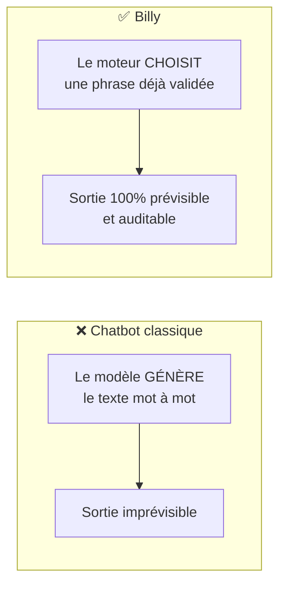
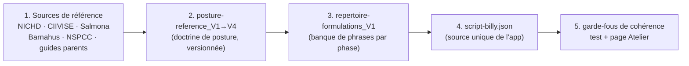
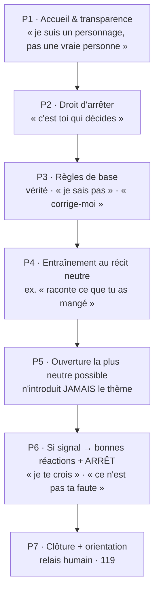
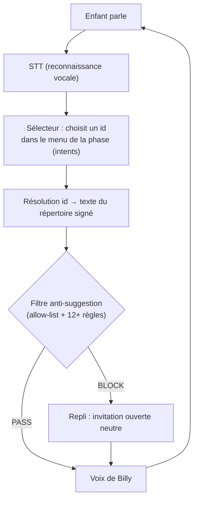
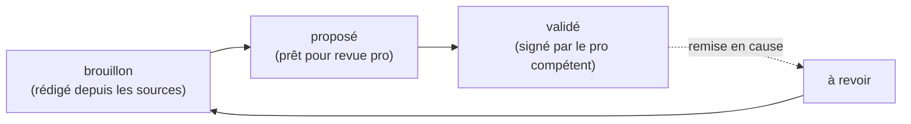

# Comment est construit le répertoire de dialogue de Billy

> Page pédagogique pour le wiki. Objectif : comprendre, sans être technicien, **pourquoi
> Billy ne parle pas comme un chatbot** et **comment chaque phrase qu'il prononce est
> fabriquée, tracée et verrouillée**.
> Source de vérité : `public/content/script-billy.json` — statut global : **brouillon, non
> validé**. Rien n'est dit à un enfant tant que les professionnels n'ont pas signé.

---

## 1. L'idée à retenir en premier

Le plus grand danger de Billy n'est **pas** qu'il réponde « à côté ». C'est qu'il **contamine
la parole de l'enfant** : souffler une réponse, nommer un acte que l'enfant n'a pas nommé,
insister, faire répéter. Une parole contaminée devient **inexploitable en justice** et peut
**blesser l'enfant**.

👉 **Tout le répertoire est construit pour rendre cette contamination impossible.** Ce n'est
pas un détail d'ergonomie, c'est le cœur du projet.

---

## 2. Le principe central : Billy *choisit*, il n'*invente* jamais

Un chatbot classique **génère** ses phrases mot à mot — donc il peut, à tout moment, dire
quelque chose d'imprévu. Billy fait l'inverse :

- Toutes ses phrases sont **écrites et validées à l'avance**, rangées dans une **liste fermée**
  (une *allow-list* = « liste d'autorisation »).
- Une phrase ne peut sortir vers la voix **que si elle est identique** à une phrase de cette
  liste (ou une invitation qui **reprend un mot déjà dit par l'enfant**, voir §6).
- Résultat : l'ensemble de ce que Billy **peut** dire est **fini, connu d'avance et auditable
  à 100 %**.



> **Si une IA intervient** (le *sélecteur*, §7), elle ne fait que **choisir un numéro de
> phrase** dans la liste. Elle n'écrit jamais le texte. Même détournée, elle ne peut que
> sélectionner une phrase déjà sûre.

---

## 3. D'où viennent les phrases : la chaîne de distillation

`script-billy.json` n'a **pas** été écrit à l'inspiration. C'est le produit d'une chaîne qui
part de **sources reconnues** et descend jusqu'au fichier que lit l'application.



1. **Sources** → on extrait des **principes de posture** : questions ouvertes uniquement ;
   ne jamais nommer un acte / une partie du corps / un lieu / un auteur ; pas de pression ;
   entretien unique ; ne pas promettre le secret ; orienter vers le **119**.
2. **`posture-reference_V1..V4.md`** → ces principes deviennent une **doctrine versionnée**
   (chaque version affine la précédente, on n'écrase jamais une version).
3. **`repertoire-formulations_V1.md`** → on rédige une **banque fermée de phrases**, classées
   par **phase NICHD**, avec les contre-exemples interdits.
4. **`script-billy.json`** → la banque devient le **fichier machine** lu par l'app. Chaque
   phrase y est un objet **traçable** (voir §4).
5. **Garde-fous de cohérence** :
   - un **test automatique** (`src/safety/script-coherence.test.js`) vérifie que **chaque
     phrase neutre du fichier passe la couche anti-suggestion** — impossible qu'une formulation
     et le filtre divergent sans casser les tests ;
   - la page **`/atelier.html`** (« Cahier de la posture ») affiche chaque phrase avec son
     intention, sa justification et sa source : c'est le **support de revue par les pros**.

---

## 4. Anatomie d'une phrase

Chaque énoncé du fichier est traçable champ par champ. Exemple réel :

```json
{
  "id": "P4-1",
  "type": "billy_demande",
  "statut": "à revoir",
  "intent": "Invitation neutre : raconter le repas du matin (concret)",
  "formulation": "Raconte-moi ce que tu as mangé ce matin.",
  "justification": "Récit épisodique NICHD, concret 2-5.",
  "source": "NICHD 2021 / techniques-interview-2-5"
}
```

| Champ | Rôle |
|---|---|
| `id` | identifiant stable (`P4-1` = phase 4, item 1) |
| `type` | nature : `billy_dit` (affirmation), `billy_demande` (invitation), `relance_ouverte`, `reaction` |
| `statut` | cycle de validation : `brouillon` → `proposé` → **`validé`** → `à revoir` |
| `formulation` | **le texte exact** que Billy peut dire — rien d'autre ne sort |
| `intent` | libellé court : **le seul élément que voit le sélecteur** pour choisir (il ne voit pas, ne renvoie pas, le texte) |
| `justification` | le principe de posture qui fonde la phrase |
| `source` | la référence d'origine (traçabilité) |

Le fichier contient aussi des sections transverses : **`interdits`** (ce que Billy ne dit
JAMAIS), **`orientation`** (les numéros par niveau d'urgence), **`rapport`** (contenu du
compte rendu), et **`selecteur`** (les paramètres de choix, §7).

---

## 5. Les 7 phases (la colonne vertébrale NICHD)

Le répertoire est rangé selon les phases d'un entretien **non-suggestif** reconnu :



**Règle d'or (Option A)** : dès qu'un **signal sérieux** apparaît (P6), Billy **n'approfondit
pas**. Il rassure **sans qualifier** le contenu et passe le relais. Le récit sensible est
recueilli par l'humain professionnel — jamais par Billy.

> En **démo neutre**, seules les phases P1-P2-P3-P4-P7 sont jouées (champ
> `selecteur.phases_demo_neutre`). P5 et P6 ne sont activées qu'après validation pro.

---

## 6. Reprendre les mots de l'enfant, sans jamais en ajouter (« Modèle A »)

Pour rester naturel sans contaminer, Billy peut relancer en **reprenant un mot que l'enfant
vient de dire** — c'est la *cued invitation* : « Tu as parlé de *[mot de l'enfant]*.
Raconte-moi ça. »

Garde-fous stricts sur cette mécanique :
- le mot **doit** venir de l'enfant (présent dans son lexique de séance) ;
- un mot **tabou** ne débloque jamais la phrase (un STT faillible ne doit pas autoriser Billy
  à prononcer l'innommable) ;
- Billy **n'ajoute aucun détail** : il ne reformule pas « en mieux », il ne suppose rien.

---

## 7. Le filtre de sûreté et le sélecteur : deux remparts

### a) Le filtre anti-suggestion (toujours, avant la voix)

Avant **chaque** prise de parole, la phrase repasse par `src/safety/antiSuggestion.js`, qui
combine :
- une **allow-list** (la phrase est-elle dans la liste signée ? sinon → bloquée) ;
- un **audit de 12+ règles** qui détectent : terme tabou, nomination d'auteur/lieu, question
  fermée, présupposition, choix forcé, pression, répétition, récompense, reformulation
  enrichie, étiquetage émotionnel, promesse de secret, minimisation…

**Fail-closed** : au moindre doute, on **bloque** et on retombe sur une invitation ouverte
neutre. Le risque par défaut est l'**absence** de phrase, jamais une phrase suggestive.

### b) Le sélecteur (rendre Billy plus vivant, sans rien lui faire inventer)

Pour que Billy enchaîne de façon plus fluide, un **sélecteur** choisit la phrase la plus
adaptée **parmi le menu de la phase en cours**. Il renvoie un `id`, **jamais du texte**.



Deux règles de sûreté du sélecteur :
- il ne choisit **que** parmi les `id` du menu courant (ou une cued invitation, §6) ;
- sur **tout signal** (détresse / révélation / danger), le **serveur impose** une séquence
  fixe — réassurance + clôture + 119 — **sans laisser le sélecteur improviser**.

> Le LLM n'est donc **jamais** en position de parler librement à l'enfant. Il aiguille un
> choix entre des phrases déjà sûres. C'est la différence entre « générer » et « sélectionner ».

---

## 8. Le cycle de validation d'une phrase



- Tant qu'une phrase n'est pas **`validé`**, elle ne doit pas être dite à un vrai enfant.
- Le statut global du fichier reste **`brouillon`**.
- Qui valide quoi : voir la page **« Le projet Billy — attentes de chaque professionnel »**
  (`docs/wiki-projet-attentes-pro.md`).

---

## 9. Pourquoi ce design est solide (résumé en 5 points)

1. **Espace de sortie fini** : Billy ne peut dire que des phrases pré-écrites → auditables à 100 %.
2. **Traçabilité** : chaque phrase porte sa source et sa justification.
3. **Filtre fail-closed** : au doute, on bloque ; jamais de phrase suggestive par défaut.
4. **IA bridée** : le sélecteur choisit un numéro, il n'écrit rien.
5. **Arrêt au premier signal** : Billy n'enquête pas, il rassure et oriente vers l'humain.

---

## 10. Pour aller plus loin
- Source unique : `public/content/script-billy.json` · vue lisible : `/atelier.html`
- Posture : `docs/posture-reference_V1.md` → `V4.md` · `docs/techniques-interview-2-5.md`
- Sûreté : `docs/spec-safety-layer.md` · `src/safety/` · `docs/redteam-rapport-V1.md`
- Cadrage & cible : `docs/00-CADRAGE.md` · `docs/cible-2-5-ans.md`
- Validation pro : `docs/00-POUR-VALIDATION-PRO.md`
